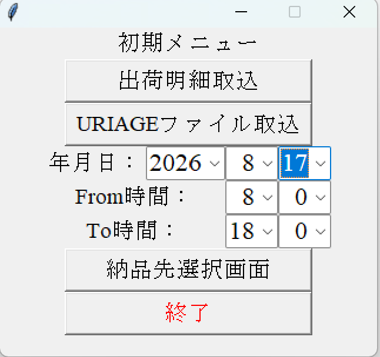
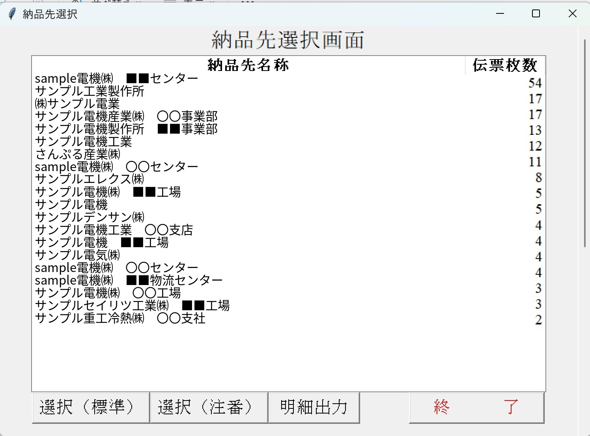
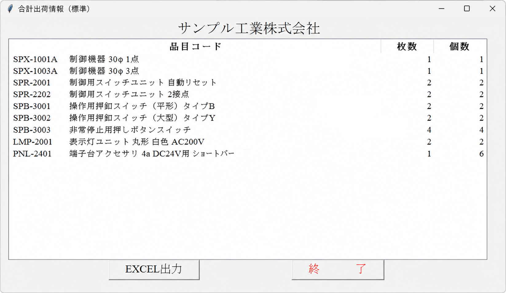

# SUMSK2 Sample / 出荷合計情報ツール（公開用サンプル）

## 概要

本リポジトリは、物流現場の『歩き回る時間』を半減させるトータルピッキング支援ツールについてです。
社内システムからExcelファイルとして出力される出荷伝票データを読み込み、**納品先別・型式別に出荷数量を集計する支援ツール**の公開用サンプルです。

Python、SQLite、Tkinterを使用して、伝票データの取り込みから集計、Excel出力までを行います。

このツールの目的は、単にExcelデータを集計することではありません。

**伝票単位で行っていた出荷作業を、現場で扱いやすい「納品先・型式単位」の情報に変換し、ピッキング作業の効率化と出荷状況の共有を支援すること**を目的として開発しました。

---

## 開発の背景と業務上の課題

### 従来の出荷業務

出荷時には、社内システムから出荷指示書を発行します。

本READMEでは、社内で使用している呼称に合わせ、出荷指示書となる納品書を「伝票」と表記します。

従来の運用では、**同一納品先・同一商品であっても、複数枚の伝票に分かれて出力される場合があります。**

例えば、同じ納品先に同じ型式の商品が複数枚の伝票に分かれていると、伝票ごとにピッキングすることで、同じ商品の棚へ何度も足を運ぶことになります。

また、似たような商品について大量の伝票が出力されるため、作業時に、

* 型式を見間違える
* 数量を見間違える
* 類似商品の伝票を取り違える

といったヒューマンエラーが発生する可能性があり、**誤出荷につながるリスク**もありました。

さらに、複数人で出荷作業を行う場合、

* 誰がどの商品を出荷したのか
* どの商品がまだ未出荷なのか

を作業者間で共有しにくいという問題もありました。

---

## 開発した仕組み

そこで、社内システムから出力した伝票データを本ツールで読み込み、**納品先別・型式別に集計した一覧表を作成する仕組み**を構築しました。

処理の流れは以下のとおりです。

```text
社内システム
    │
    │ 伝票データをExcel出力
    ▼
┌──────────────────┐
│ SUMSK2            │
│                   │
│ Excelデータ取込   │
│       ↓           │
│ SQLiteへ格納      │
│       ↓           │
│ 納品先・型式別集計 │
└──────────────────┘
    │
    │ Excel出力
    ▼
納品先別・型式別集計表
    │
    │ SharePointへ配置
    ▼
作業者がブラウザから共有表を参照
    │
    ▼
出荷済みの商品に担当者ごとの色を付ける
    │
    ▼
出荷済み・未出荷の状況を共有
```

### 集計イメージ

例えば、従来は以下のように同じ商品が複数の伝票に分かれていたとします。

```text
伝票1　納品先A　型式X　10個
伝票2　納品先A　型式X　 5個
伝票3　納品先A　型式Y　 8個
伝票4　納品先A　型式X　 7個
```

本ツールでは、これを納品先・型式単位に集計します。

```text
納品先A

型式X　22個
型式Y　 8個
```

これにより、同じ型式の商品をまとめて確認・ピッキングできるようにします。

---

## SharePointを利用した出荷状況の共有

集計した結果はExcelファイルとして出力し、SharePoint上に配置します。

作業者はブラウザから同じExcel表を参照できるため、複数人で出荷作業を行う際にも、共通の一覧表を使用できます。

さらに、**作業者ごとに色を決め、出荷済みの商品に担当者の色を付ける**運用とすることで、出荷状況を視覚的に確認できます。

例えば、

```text
型式        数量    出荷状況

型式A       10      ← 担当者Aの色
型式B        5      ← 担当者Bの色
型式C        8      ← 未出荷
型式D       12      ← 担当者Aの色
```

という形で、一覧を見ることで、

* 誰がどの商品を出荷したのか
* どの商品がまだ未出荷なのか

を作業者間で共有できます。

---

## この仕組みによる改善

本ツールでは、伝票データを単純にExcelへ出力し直すのではなく、**実際の出荷作業で利用しやすい単位へ情報を整理する**ことを重視しています。

### 1. 同一商品のまとめ出荷

同一納品先・同一型式の商品をまとめて確認できるため、伝票単位で作業する場合と比較して、同じ商品の棚へ何度も足を運ぶ必要を減らすことができます。

### 2. 型式・数量の確認をしやすくする

大量の伝票を1枚ずつ確認するのではなく、納品先・型式別に整理された一覧表を使用することで、出荷対象の商品と数量を確認しやすくします。

これにより、型式や数量の見間違いによる誤出荷リスクの低減を図ります。

### 3. 出荷状況を作業者間で共有

SharePoint上のExcelを共通の一覧表として使用し、出荷済みの商品に担当者ごとの色を付けることで、出荷済み・未出荷の状況を作業者間で共有できます。

### 4. 作業状況の把握

個々の作業者がどの商品を担当したのかを色で確認できるため、出荷作業全体の進捗を把握しやすくなります。

---

## このサンプルで伝えたいこと

このリポジトリで示したいのは、Pythonのプログラムを書けることだけではありません。

実際の業務では、既存のシステムをすべて新しいシステムへ置き換える必要があるとは限りません。

本ツールでは、既存システムから出力されるExcelデータを活用し、

**既存システム**
↓
**データを取り込む**
↓
**必要な情報に整理・集計する**
↓
**現場で使いやすいExcelとして出力する**
↓
**SharePointで作業者間に共有する**

という形で、既存の業務環境を活用しながら改善する方法を採用しています。

このような、

* 現場の業務上の問題を把握する
* 必要なデータを整理する
* Pythonで処理を自動化する
* Excelを現場で利用しやすい形に変換する
* SharePointを利用して情報を共有する

といった、**現場に合わせた実務的な業務改善**を意識したサンプルです。

---

## 公開方針（重要）

このリポジトリは **公開用サンプル** です。

以下の点に配慮しています。

* 実際の業務データは含みません
* 実在の取引先名・実在の品目情報は含みません
* * 実際の業務画面をそのまま掲載せず、実データ・固有名詞を匿名化した公開用サンプル画面を使用しています
* 社外公開に適した範囲で、構成・考え方・実装例を示すことを目的としています

---

## 画面構成（公開用モックアップ）

ここでは公開用に、実画面を加工したサンプル画像を用意しています。


### 1. メイン画面

以下の操作を行う想定です。

* 出荷明細データ取込
* 売上データ取込
* 対象日付・時間帯の指定
* 届け先選択画面を開く



### 2. 届け先選択画面

指定した日付・時間帯のデータをもとに、届け先ごとの一覧を表示します。

**表示項目：**

* 届け先名称
* 枚数

**ここから実行できる処理：**

* 選択（標準）
* 選択（注番）
* 明細出力



### 3. 合計出荷情報（標準）

届け先単位で、**標準集計**を表示します。

**表示項目：**

* 品目コード
* 枚数
* 個数
* 棚番

この画面から **Excel出力**が可能です。

**出力ファイル例：**

* `届け先A_出荷合計数（標準）.xlsx`



### 4. 合計出荷情報（注番）

届け先単位で、**注番単位の集計**を表示します。

**表示項目：**

* 注番
* 品目コード
* 枚数
* 個数
* 棚番

この画面から **Excel出力**が可能です。

**出力ファイル例：**

* `届け先A_出荷合計数（注番）.xlsx`

### 5. 出荷明細（Excel出力）

届け先単位で、明細データをExcel出力します。

**出力項目：**

* GRP
* 品目コード
* 品名
* 個数
* 注文番号
* 棚番
* 売上№
* 行番号

**出力ファイル例：**

* `届け先A_出荷明細.xlsx`

---

## ファイル構成

```text
.
├─ data/
│  ├─ sales_data.xlsx
│  ├─ shipment_detail.xlsx
│  └─ shelf_master.xlsx
├─ images/
│  ├─ SUMSK2_初期画面_サンプル.png
│  ├─ SUMSK2_商品選択_サンプル.jpg
│  └─ SUMSK2_納品先選択_サンプル.jpg
├─ app.py
├─ import_shipment.py
├─ import_sales.py
├─ file_utils.py
├─ requirements.txt
└─ README.md

なお、同梱サンプルは 2026/04/20、09:00 のデータです。
```

---

## 処理概要

### 1. 出荷明細データ取込

* Excelファイルから出荷明細データを読み込み
* SQLiteへ取り込み
* 集計用の一時テーブルとして利用

### 2. 売上データ取込

* Excelファイルから売上データを読み込み
* 必要なデータをSQLiteへ取り込み
* 明細との突合に使用

### 3. 届け先選択

* 指定した日付・時間帯のデータを対象に
* 届け先ごとの一覧を表示

### 4. 合計出荷情報（標準）

* 届け先単位
* 品目コード単位で集計
* 表示 / Excel出力

### 5. 合計出荷情報（注番）

* 届け先単位
* 注番 + 品目コード単位で集計
* 表示 / Excel出力

### 6. 出荷明細出力

* 届け先単位
* 明細データをExcel出力
* 品目コードの切り替わりで `GRP` 列に記号を付与（公開用サンプル）

---

## 動作環境

* Python 3.10 以上推奨
* Windows環境想定（Tkinter GUI）

---

## 使用ライブラリ

* pandas
* openpyxl

※ `tkinter` と `sqlite3` はPython標準ライブラリを使用しています。

---

## セットアップ

```bash
pip install -r requirements.txt
```

---

## 実行方法

```bash
python app.py
```

---

## 注意事項

* このリポジトリは **公開用サンプル**です
* 実際の運用ファイル名・項目名・業務ロジックは一部簡略化または一般化しています
* 実データ・実画面・実在の取引先情報は含みません
* 実運用環境では、入力Excelの列構成やDB構造に依存するため、そのままでは動作しない可能性があります

---

## ライセンス / 取り扱い

* 学習・参考用途を想定した公開用サンプルです
* 実業務への適用時は、入力ファイル仕様・DB構造・エラー処理を確認のうえ調整してください

---

## Author

業務改善・データ整形・既存業務システム補助ツールのサンプルとして公開しています。

**「現場の問題を把握し、既存の業務環境を活用しながら、実際の作業に役立つ仕組みへ改善する」**ことを意識した構成です。
